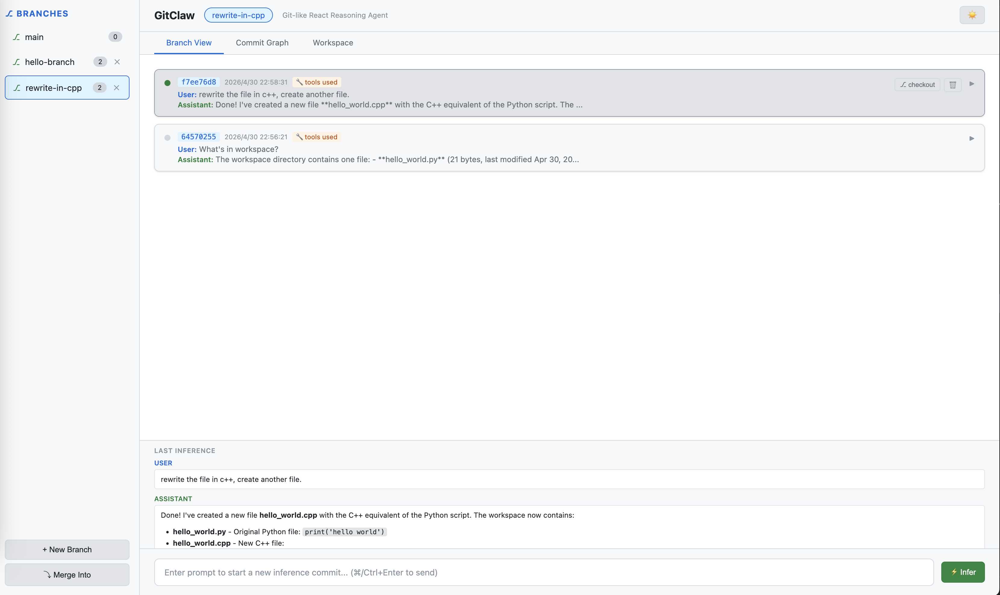
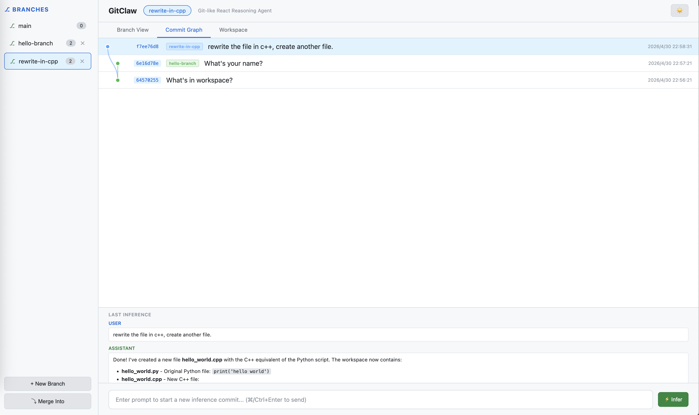
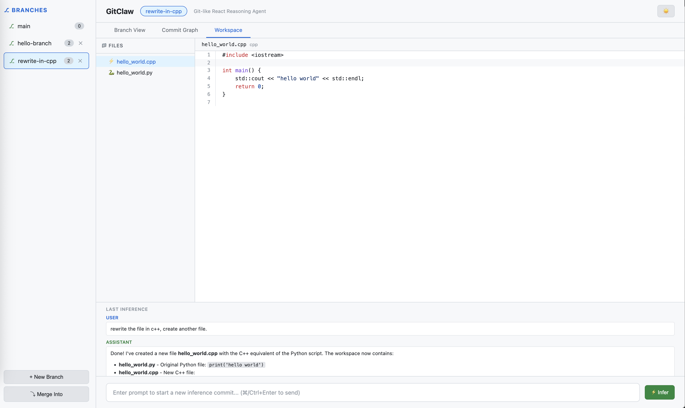

# GitClaw

> Agent 在长期运行后，混乱而复杂的上下文管理让我苦恼，受 Git 的启发，我编写了这个项目。

GitClaw 是一个**类 Git 的 ReAct 推理器** —— 将 LLM 推理会话以分支和提交的方式管理，让你对发散的思维链拥有完整的控制力。

## 核心思想

- 每次**推理**就是一次 **commit** —— 完整的推理步骤（User → 工具调用 → Assistant）。
- 对话存在于**分支**上，可从任意 commit **checkout** 出新分支，探索不同推理路径。
- 上下文通过回溯 commit 历史构建，就像 `git log`。

## 功能

- 🌿 **分支与提交** —— 创建、删除、从任意 commit 分叉，管理并行推理链。
- 🔀 **合并** —— 按时间顺序穿插合并分支的 commit 历史。
- 🔧 **工具调用 (ReAct)** —— Agent 循环调用工具，直到得出最终答案。
- ⚠️ **危险命令拦截** —— `rm` 等命令需用户二次确认后才执行。
- 📁 **工作区** —— 内置文件浏览器，支持语法高亮的代码查看。
- 📡 **流式输出** —— 实时 SSE 流式传输 LLM 响应和工具调用过程。
- 🗄️ **SQLite 持久化** —— 所有分支和提交持久存储。
- 🎨 **Commit 图** —— SourceTree 风格的可视化分支图谱。
- 🌗 **日间/夜间主题** —— 一键切换明暗模式。

## 截图

| Branch View | Commit Graph | Workspace |
|:---:|:---:|:---:|
|  |  |  |

## 快速开始

```bash
pip install flask requests
cd web
python app.py
```

打开 `http://localhost:8171`。

> **注意：** 需要 OpenAI 兼容的 LLM API 运行在 `http://localhost:1234/v1/chat/completions`（如 LM Studio、Ollama 等）。

## 项目结构

```
git-claw/
├── tools/              # ReAct 工具定义
│   ├── base.py
│   └── exec.py         # Shell 执行（含 rm 拦截）
├── web/
│   ├── app.py          # Flask 后端（Agent + API）
│   ├── templates/
│   │   └── index.html  # 单页前端
│   └── workspace/      # Agent 的文件工作区
└── react.py            # 独立 CLI agent
```

## License

MIT
